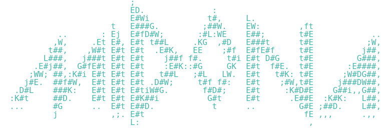

<div align="center">
	<h1>Midona</h1>
	<a href="https://github.com/Gun8hoot/Midona"></a>
</div>
<br>
<div align="center">
	<h2>Warning : </h2>
	<p>I (Nathan "Gun8hoot" CLAVEL) am not in charge of the bad/good usage or the modification of my program.</p>
	<p>I've created this program for education purposes only and it should not be used to evade any protection.</p>
</div>
<div align="center">
	<h1>Description : </h1>
</div>

Midona is a [crypter](https://www.malwarebytes.com/blog/news/2015/12/malware-crypters-the-deceptive-first-layer) that can both compress and/or encrypt an [ELF binary](https://en.wikipedia.org/wiki/Executable_and_Linkable_Format).

<div align="center">
	<h1>Usage : </h1>
</div>

1. Clone the repository on your computer and go inside
```sh
git clone git@github.com:Gun8hoot/Midona.git && cd Midona
```
2. Compile the program using GNU Make
```sh
make
```
3. Use the program
```sh
# Example:
./midona -b compiled_file
```
